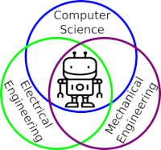
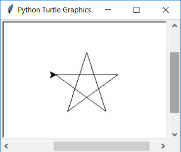

Introduction
============

 
I designed this project for a 10-hour workshop for ChickTech.org whose goal is to introduce teenage women to STEM topics. The goals for this project were:

- Easy to build.
- Easy to program.
- Did something interesting.
- Low-cost so participants could take it home and continue to learn.

 

Robotics is the exciting intersection of a number of engineering fields including mechanical engineering, electrical engineering, and computer science. This project was designed to make learning about these fields accessible and exciting.

Turtle robots are controled by simple instructions like "forward(distance)" and "left(degrees)", and their visual tracks are instructive as well as entertaining. They also demonstrate how systems with simple rules can have complex behaviors, something we see in nature all the time.

 
 

Python is a popular and easy to learn programming language that already has Turle Graphics built in.  Since the robots instructions are the same, programs and paterns can be evaluated on the computer and then run on the robot.

See a short [Show and Tell](https://youtu.be/j0FpB0iv0v0).

This robot has been refined through a number workshops, but still has room for improvement.  Please share your ideas and modifications so it can continue to improve.
 

Bill Of Materials
=================

Electronics:

- 1 ea. Park Purfect Purple PCB from /design_files folder
- 1 ea. Adafruit ItsyBitsy 3V, https://www.digikey.com/short/jw9mwm
- 1 ea. ULN2803 Darlington Driver, [STM ULN2803A](https://www.digikey.com/short/q728f3)
- 1 ea. CONN IC DIP SOCKET 18POS TIN [On Shore ED18DT](https://www.digikey.com/short/jd3rvh) (optional)
- 2 ea. JST B5B-XH-A Receptical, [JST B5B-XH-A](https://www.digikey.com/short/qcrr5m)
- 1 ea. SPST switch, [E-Switch EG1218](https://www.digikey.com/short/qcwd5b)
- 1 ea. Tactitle switch, [TE 1825910-6](https://www.digikey.com/short/q32j9w)
- 2 ea. 14-POS Female header, ‎S7012-ND‎ or 1212-1101-ND‎
- 1 ea. pin male header, [Sullins PREC040SAAN-RC](https://www.digikey.com/short/jzr38f)
- 2 ea. TERMINAL 3.5MM 2POS, [On Shore ED555/2DS](http://www.digikey.com/short/7zj1f4)
- 2 ea. 2 x AA Holder, [Keystone 2463](http://www.digikey.com/short/tz5bd1)
- 1 ea. 100 uF cap, [Nichicon UMA1E101MDD](https://www.digikey.com/short/jd3rdz)
- 1 ea. 10 uF cap, [Panasonic ECE-A1HKS100](http://www.digikey.com/short/7thwrt)
- 1 ea. 1 uF cap, [AVX SR205E105MAR](http://www.digikey.com/short/747wv0)
- 4 ea. AA batteries, [Panasonic LR6XWA/B](https://www.digikey.com/short/qcwdbb)
- 2 ea. Photo Transistor, https://www.digikey.com/short/jw9ht0
- 2 ea. IR Emitter 940nm 1.2V, https://www.digikey.com/short/jw9m1r
- 2 ea. 100 ohm resistor 1/8W, https://www.digikey.com/short/q72818)
- 2 ea. 330 ohm resistor 1/8W, [Stackpole CF18JT330R](https://www.digikey.com/short/jzr35t)
- 2 ea. 10K resistor 1/8W, 
- 2 ea. 3mm LEDs, [Wurth 151031VS06000](http://www.digikey.com/short/3335hz)
- 2 ea. Geared 5V Stepper, [28byj](http://a.co/hwCrUy4)
- 1 ea. Micro servo, [SG 9G](http://www.adafruit.com/products/169
- 1 ea. USB 2.0 A Male to Micro B cable, http://a.co/bYaNDg6

Hardware:

- 2 ea. 1 7/8" ID x 3/16' O-ring, http://www.mcmaster.com/#9452k47/=yskfyu
- 1 ea. Caster 5/8" bearing, http://www.mcmaster.com/#96455k58/=yskbki
- 8 ea. M3 x 6mm rounded head screw, https://www.mcmaster.com/#92005a116/=19rb37d
- 4 ea. M3 x 6mm flat head screw, http://www.mcmaster.com/#91420a116/=yskru0
- 10 ea. M3 Nut, http://www.mcmaster.com/#90591a250/=yskc6u
- 4 ea. #2 x 1/4 thread forming screw, https://www.mcmaster.com/#90380a005/=19o9cmt
   
* Substitute at your own risk

Design Files
============
The electronics were designed using Open Source [KiCad](http://kicad-pcb.org/). Design files are located in the [design_files](design_files/) folder.  You can oogle the [schematic](docs/Schematic.pdf).

The 3D Design files are located in the [3D](3D/) folder.

Firmware
========
This project is programed using the Open Source [Arduino](https://www.arduino.cc/). The firmware is located in the [firmware](firmware/) folder.  Instructions for setting up the Arduino enviroment for the Adafruit Trinket Pro are at [https://learn.adafruit.com/introducing-pro-trinket](https://learn.adafruit.com/introducing-pro-trinket).

Assembly Instructions
=====================
Located in the [docs](docs/) folder.

License
=======
[Attribution-ShareAlike 3.0 United States (CC BY-SA 3.0 US)](https://creativecommons.org/licenses/by-sa/3.0/us/)

You are free to:

- Share — copy and redistribute the material in any medium or format
- Adapt — remix, transform, and build upon the material

Under the following terms:

- Attribution — You must give appropriate credit, provide a link to the license, and indicate if changes were made. You may do so in any reasonable manner, but not in any way that suggests the licensor endorses you or your use.
- ShareAlike — If you remix, transform, or build upon the material, you must distribute your contributions under the same license as the original.
